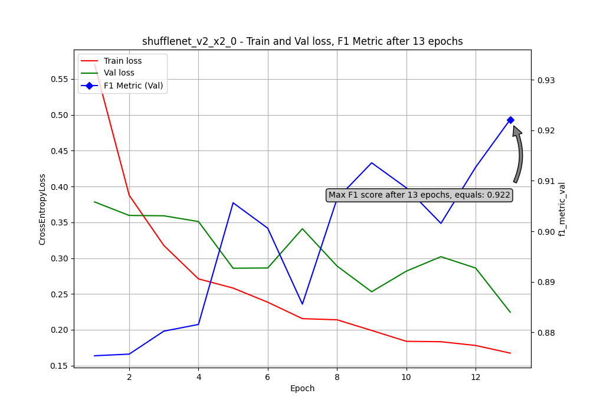

# Ensemble Fine-Tuned CNN Models for Polish Christmas Dishes Classification

## Description

This repository demonstrates the use of ensemble learning with fine-tuned CNN models for the classification of traditional Polish Christmas dishes. The project was developed as a part of an image classification hackathon.

### Data

The dataset consists of images from the following categories:

- Mushroom Soup (*Zupa Grzybowa*)
- Cheesecake (*Sernik*)
- Dumplings (*Pierogi*)
- Gingerbread (*Pierniki*)
- Poppy Seed Cake (*Makowiec*)
- Kutia (*Kutia*)
- Hunter's Stew (*Bigos*)
- Beetroot Soup (*Barszcz*)

The dataset was collected manually and supplemented using tools to download images from websites, ensuring a diverse representation of traditional Polish Christmas dishes.

### Models

The models used in this project are:

| Model                         | Number of Parameters | Documentation Link                                               |
|-------------------------------|----------------------|------------------------------------------------------------------|
| **EfficientNet-B0**            | 5,288,548            | [EfficientNet-B0 (torchvision)](https://pytorch.org/vision/2.0/models/generated/torchvision.models.efficientnet_b0.html#torchvision.models.efficientnet_b0) |
| **EfficientNet-B1**            | 7,794,184            | [EfficientNet-B1 (torchvision)](https://pytorch.org/vision/2.0/models/generated/torchvision.models.efficientnet_b1.html#torchvision.models.efficientnet_b1) |
| **MobileNetV3 Large**          | 5,483,032            | [MobileNetV3 Large (torchvision)](https://pytorch.org/vision/2.0/models/generated/torchvision.models.mobilenet_v3_large.html#torchvision.models.mobilenet_v3_large) |
| **ShuffleNetV2 X2.0**          | 7,393,996            | [ShuffleNetV2 X2.0 (torchvision)](https://pytorch.org/vision/2.0/models/generated/torchvision.models.shufflenet_v2_x2_0.html#torchvision.models.shufflenet_v2_x2_0) |
| **GhostNet 100**               | 5,200,000            | [GhostNet 100 (Hugging Face)](https://huggingface.co/timm/ghostnet_100.in1k) |
| **MNASNet1.3**                 | 6,282,256            | [MNASNet1.3 (torchvision)](https://pytorch.org/vision/2.0/models/generated/torchvision.models.mnasnet1_3.html#torchvision.models.mnasnet1_3) |
| **RegNetY-800MF**              | 6,432,512            | [RegNetY-800MF (torchvision)](https://pytorch.org/vision/2.0/models/generated/torchvision.models.regnet_y_800mf.html#torchvision.models.regnet_y_800mf) |
| **ResNet-18**                  | 11,689,512           | [ResNet-18 (torchvision)](https://pytorch.org/vision/2.0/models/generated/torchvision.models.resnet18.html#torchvision.models.resnet18) |
| **ViT-Tiny**                   | 5,717,416            | [ViT-Tiny (TIMM)](https://github.com/huggingface/pytorch-image-models/blob/main/timm/models/tiny_vit.py) |


The learning curves for two models are down below:




### Ensembles and Weights

In this project, an **ensemble learning** approach has been used with **weighted voting** to combine the predictions of multiple fine-tuned models. Each model's contribution is weighted based on its performance during validation.

### Selection of Final Models

The final four models for the ensemble were selected through an automated process of testing every combination of the models with weight powers (in the weighted voting scheme) ranging from 1 to 10. The combination with the highest **F1 score** on the test set was chosen as the final ensemble. **The first four models shown in the table above have made their way to the final ensemble.**

### Transformations

The dataset was preprocessed and augmented with a [transform pipeline](/src/utils/dataset.py). Examples of transformations include resizing, rotation, and color adjustments, as shown below:


<br>

## Setup and Configuration

To clone the repository, use the command:
```bash
git clone https://github.com/DzmitryPihulski/ensemble-finetuned-models.git
